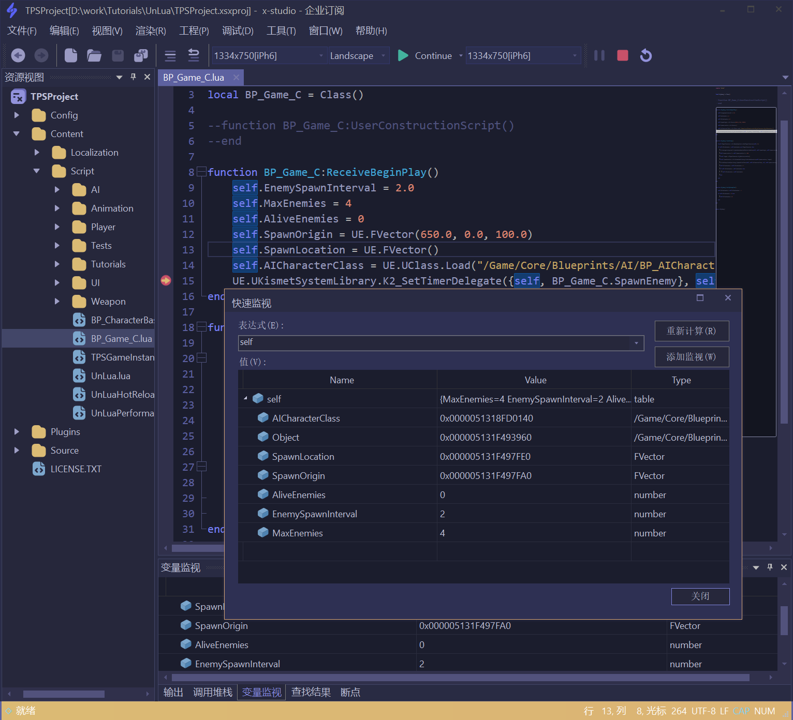

# 虚幻引擎 Lua调试

!!! attention "注意"
    - 本教程自`V2021.4.2`版本发布后可用
    - 调试虚幻引擎Lua项目，编译模式应该是 ``Development Editor`` 或 ``DebugGame Editor``，且默认支持为腾讯的 ``UnLua-1.x`` 和 ``sluaunreal``，若要支持其他Lua解决方案，修改 ``xxx.xsxproj`` 工程文件(xml格式) ``debug-options/lvm-dll-pattern`` 正则表达式匹配相应插件dll名称即可。
    - 将在`v2022.1.7`版本支持UnLua-2.x的调试，当该版本发布后，建议所有用户立即更新，带来更好的虚幻Lua调试体验
    - 自`v2022.1.7`起附加到虚幻编辑器工具栏菜单项由原来的`Attach To UE4Editor`和`Attach To UE5Editor`统一为`Attach To UnrealEditor`，软件会自动查找和工程名匹配的虚幻编辑器进程进行附加，否则会弹框二次确认

## 基本步骤

### 1步创建调试工程

  将虚幻引擎游戏项目目录拖入编辑器即可，如图所示：
  

### 开始调试

  按F9打断点，软件会 **自动识别虚幻引擎游戏项目**,
  因此按F5会直接附加到UE4或者UE5的Editor进程，虚幻引擎编辑器中启动预览游戏，命中断点后可查看调用堆栈，鼠标悬浮变量监视，
  或者将变量拖入变量监视窗口，也可以按Shift+F9打开快速监视对话框，如图所示：

  

##  附加技巧

  自`v2022.1.7`发布后，完全适配了虚幻4和虚幻5编辑器，可通过工具栏快速启动菜单`Local Lua Debugger`直接启动虚幻编辑器打开当前进程，并进行Lua调试。

!!! attention "注意事项"

    * 目前附加到虚幻引擎Editor进程后，退出软件会结束虚幻引擎Editor进程，请谨慎操作，后续软件更新会专注优化这个体验。
