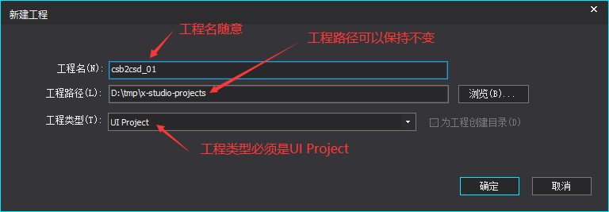
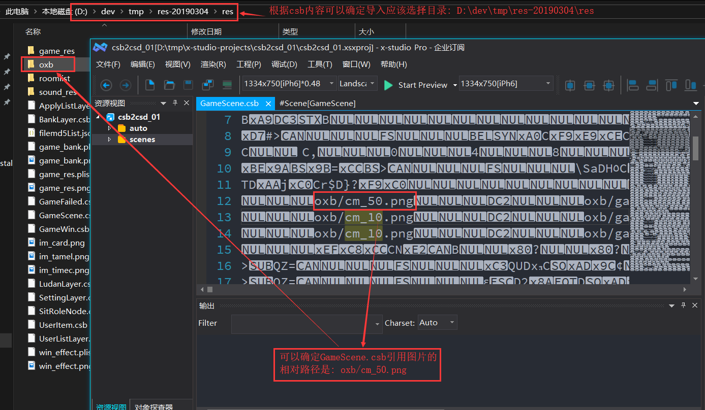

# CSD恢复

!!! info "提示"

    视频教程请访问: https://www.bilibili.com/video/BV1Uv411q7nr?t=56

!!! important "重要"

    - ``导入时选择目录`` + ``csb引用图片相对路径`` = ``图片在磁盘的绝对路径``；**只有符合这条规则，导入后，软件才可以正常加载到图片。**
    - 目前只支持导入 ``CocosStudio1.x/2.x/3.10发布的.csb`` 和 ``CocoStudio2.x发布的.json`` , 以纯文本方式打开即可查看版本信息。
    - **付费授权后才能发布csd**, 请前往官网购买授权: https://x-studio.net/

## 1. 通过软件主菜单【文件】【新建工程】新建一个空UI工程，如图所示：

   

## 2. 通过软件主菜单 【文件】【导入】【CocosStudio(*.csb/*.json)】 导入资源目录

   资源根目录确定方法: 在系统资源管理器右键【Open with x-studio】打开待导入资源随便一个.csb
   如图所示：

   

   打开后显示如图所示：

   
   虽然是乱码，但我们依然可以看到csb引用到的图片的相对路径。如上图所示，我们可以确定导入时应该选择
   ``D:\dev\tmp\res-20190304\res`` 。

## 3. 查看导入界面，调整设计尺寸

   导入完成后，记得在 **资源视图** 双击打开界面，如果界面显示不全请修改和原界面相同尺寸，
   原界面设计尺寸可在对象探查器查看根节点属性大小来确定, 如图所示:

   

   ``如果没有需要的尺寸，通过软件主菜单【文件】【打开】【打开软件配置文件】，添加设计尺寸后重启软件即可``

## 4. 发布.ccs工程
   通过软件主菜单【工程】【发布】发布到CocosStudio2.x兼容的.ccs工程，
   **注意: 发布选项里CSLoader版本一定要选择2.1.0.0**，
   如果不确定，可以通过软件主菜单【工程】【发布选项(S)...】打开发布选项对话框，如图所示：

   

## 5. 使用CocosStudio2.3.3或者3.10打开发布后的工程，如下图所示：

   

!!! note "注意"
    由于不同项目情况复杂，原始项目可能有多个ui工程， 最终发布到游戏资源根目录的不同目录层级下，且各自引用资源相对路径可能有差异，然后在程序中设置 `搜索路径` 来正常加载资源。因此针对这种情况，你需要创建多个工程，选择不同目录，依然是根据.csb里的路径来确定导入目录。
